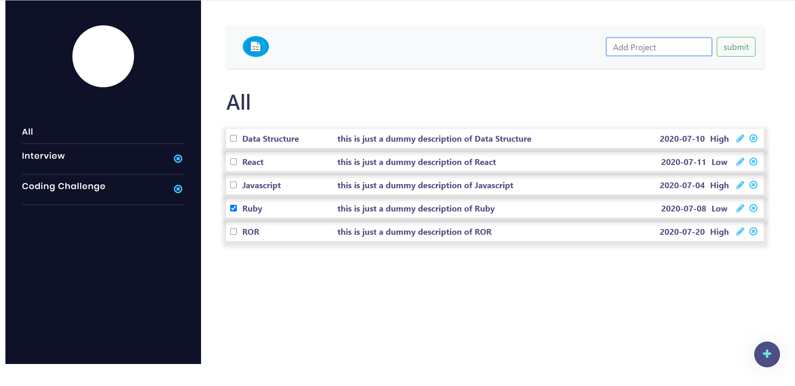

# The Todo List

[![Contributors][contributors-shield]][contributors-url]
[![Forks][forks-shield]][forks-url]
[![Stargazers][stars-shield]][stars-url]
[![Issues][issues-shield]][issues-url]

In this project, we are building TODO List with javascript vanilla, ES6 and webpack.

### Landing Page



### Adding To-Do List


### Adding Project Title


### Todo state


## Live Demo

- [Production](https://rawcdn.githack.com/Cyrus-Kiprop/Todo-List/6448b38ed31d729994aa14917a17026b86b95b2b/index.html)

- [Deployment](https://raw.githack.com/Cyrus-Kiprop/Todo-List/gh-pages/index.html)

## Built With

- HTML + CSS
- JavaScript
- Bootstrap

## Getting Started

To get started with the app, cd to the directory where you would like the repo to live by typing on your terminal:

Clone the repo typing:

```
$git clone https://github.com/Cyrus-Kiprop/Todo-List.git
```

# User Interation UI

- User can view all projects.
- Users can view all todos in each project.
- Users can expand a single todo to see/edit its details.
- Users can delete a todo.
- Users can toggle between complete and uncomplete by just clicking the check box.
- Users can add a project title under which they want to add the todo list.


## Authors

👤 **Cyrus Kiprop**

- Github: [Cyrus-Kiprop](https://github.com/Cyrus-Kiprop)
- Twitter: [@kipropJS](https://twitter.com/kipropJS)
- Linkedin: [Cyrus Kiprop](https://www.linkedin.com/in/cyrus-kiprop-ba7320120/)

👤 **Shubham Raj**

- Github: [@ShubhamRaj](https://github.com/shubham14p3)
- Linkedin: [Shubham14p3](https://www.linkedin.com/in/shubham14p3/)

## 🤝 Contributing

Contributions, issues and feature requests are welcome!

Feel free to check the [issues page](https://github.com/Cyrus-Kiprop/Todo-List/issues/).

## Show your support

Give a ⭐️ if you like this project!

## Acknowledgments

- Project requested by [Microverse Program](https://www.microverse.org/).

## Future Enhancement 

- Adding More Validation.
- Making the Mobile friendly.

<!-- MARKDOWN LINKS & IMAGES -->

[contributors-shield]: https://img.shields.io/github/contributors/Cyrus-Kiprop/Todo-List.svg?style=flat-square
[contributors-url]: https://github.com/Cyrus-Kiprop/Todo-List/graphs/contributors
[forks-shield]: https://img.shields.io/github/forks/Cyrus-Kiprop/Todo-List.svg?style=flat-square
[forks-url]: https://github.com/Cyrus-Kiprop/Todo-List/network/members
[stars-shield]: https://img.shields.io/github/stars/Cyrus-Kiprop/Todo-List.svg?style=flat-square
[stars-url]: https://github.com/Cyrus-Kiprop/Todo-List/stargazers
[issues-shield]: https://img.shields.io/github/issues/Cyrus-Kiprop/Todo-List.svg?style=flat-square
[issues-url]: https://github.com/Cyrus-Kiprop/Todo-List/issues
